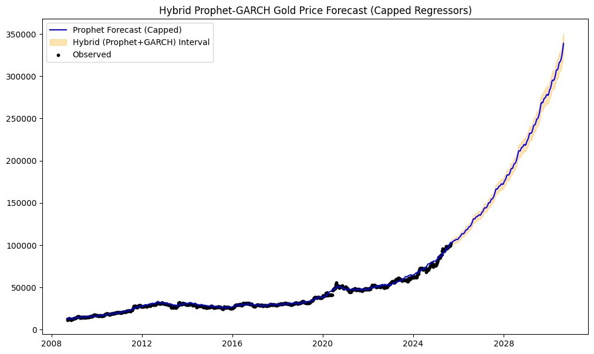
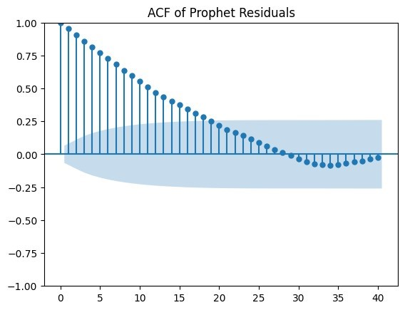

🏆 Gold Price Forecasting in India using Machine Learning & Time Series

📌 Project Overview

This project focuses on forecasting **weekly gold prices in India** using advanced **Time Series Forecasting** and **Machine Learning** techniques. Multiple forecasting models were developed, compared, and evaluated to identify the most accurate approach for long-term gold price prediction.

The study combines macroeconomic indicators with statistical and machine learning models to improve forecasting accuracy and provide reliable prediction intervals.

---

🎯 Objectives

- Forecast weekly gold prices for the next 5 years.
- Compare the performance of multiple forecasting models.
- Analyze the impact of macroeconomic indicators on gold prices.
- Generate reliable prediction intervals for financial decision-making.

---

📊 Dataset

- Duration: September 2008 – August 2025
- Frequency: Weekly
- Observations: 6209
- Country: India

Features Used

- Gold Price (INR)
- USD/INR Exchange Rate
- Crude Oil Price
- NSE Index
- Inflation Rate
- Repo Rate

---

🛠️ Technologies Used

- Python
- Pandas
- NumPy
- Matplotlib
- Statsmodels
- Prophet
- ARCH (GARCH)
- Scikit-learn
- Jupyter Notebook

---

📈 Models Implemented

1. Prophet with Lagged Regressors
- Trend & seasonality forecasting
- Lagged macroeconomic variables
- Log transformation

2. GARCH (1,1)
- Volatility modelling
- Risk estimation
- Financial time-series analysis

3. Hybrid Prophet-GARCH
- Combined Prophet forecasts with GARCH volatility bands
- Improved prediction intervals
- Better long-term forecasting accuracy

---

⚙️ Feature Engineering

- Weekly data aggregation
- Log transformation
- Lagged macroeconomic variables
- Train-Test Split
- Missing value handling
- Outlier checking

---

📊 Statistical Validation

The following statistical tests were performed:

- Augmented Dickey-Fuller (ADF) Test
- Stationarity Analysis
- Residual Analysis
- Autocorrelation (ACF)
- PACF
- Q-Q Plot
- Volatility Clustering

---

📉 Model Performance

| Model | MAPE | Performance |
|-------|------|-------------|
| Prophet | 21.26% | Moderate |
| Hybrid Prophet-GARCH | 248.37% | Poor (Implementation Issue) |
| Hybrid Prophet-GARCH (Capped Macro) | 4.20%| ⭐ Best Model |

---

📌 Key Results

- Achieved approximately **4.2% MAPE** using the Hybrid Prophet-GARCH model with capped macroeconomic regressors.
- Successfully captured long-term trends and market volatility.
- Generated reliable prediction intervals for future gold prices.
- Demonstrated the importance of macroeconomic variables in forecasting accuracy.

---
## 📸 Project Screenshots

### Hybrid Prophet-GARCH Forecast

---

### ACF of Prophet Residuals

📂 Repository Structure

gold-price-forecasting-india/
│
├── Gold_Price_Forecasting.ipynb
├── Gold_Price_Dataset.xlsx
├── Gold_Price_Forecasting_Report.pdf
└── README.md

---

🚀 Future Improvements

- LSTM-based forecasting
- XGBoost Regression
- Streamlit Web Application
- Real-time Gold Price API
- Interactive Dashboard using Power BI

---

💼 Skills Demonstrated

- Time Series Forecasting
- Machine Learning
- Statistical Analysis
- Feature Engineering
- Data Visualization
- Financial Data Analytics
- Model Evaluation
- Python Programming

---

 👩‍💻 Author

Pranali Patil

M.Sc. Statistics | Aspiring Data Scientist | Data Analyst

GitHub: https://github.com/pranalip10

LinkedIn: www.linkedin.com/in/pranali26

---

⭐ If you found this project interesting, consider giving it a Star!
